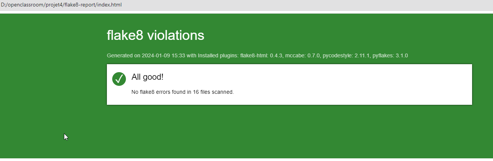
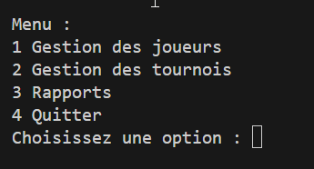
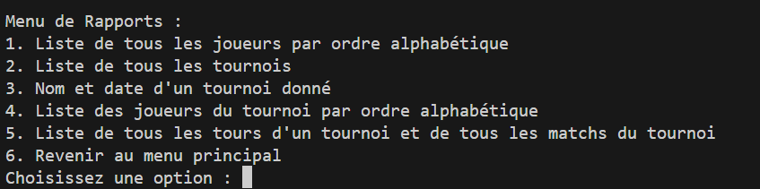
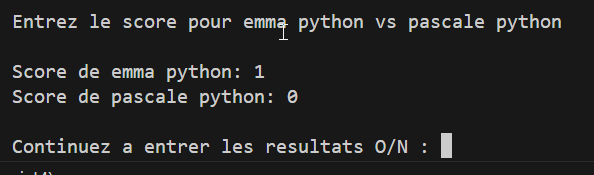
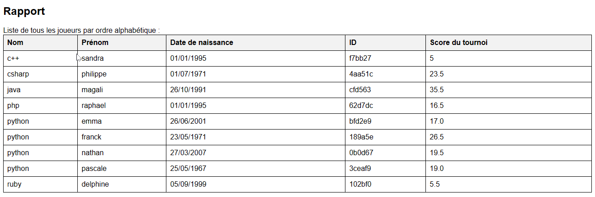
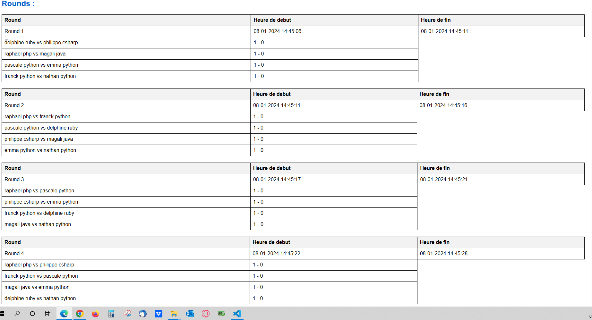

# Projet 4 Tournoi Echecs
***logiciel de gestion de tournoi d'échecs.***

Développé sous Windows 10  et Python version 3.10.11

## Table des matières

1. [Installation du projet](#chapitre1)
    1. [Windows](#chapitre1-1)
    1. [MacOS et Linux](#chapitre1-2)
    3. [Générer un rapport flake8](#chapitre1-3)
2. [menus du programme](#chapitre2)
    1. [Menu principal](#chapitre2-1)
    2. [Menu des Rapports](#chapitre2-2)
3. [Exemple de match et de rapports](#chapitre3)
    1. [Affichage entrée d'un match](#chapitre3-1)
    2. [Exemple de Rapports](#chapitre3-2)

## 1. Initialisation du projet

#### i. Windows :
Dans Windows Powershell, naviguer vers le dossier souhaité.
###### Récupération du projet

     git clone https://github.com/canofranck/projet4_tournoi_d_echecs

###### Activer l'environnement virtuel
    cd Repertoire_du_projet
    python -m venv env 
    env\scripts\activate
    
###### Installer les packages requis
    pip install -r requirements.txt

###### Lancer le programme
    python main.py

---------

#### ii. MacOS et Linux :
Dans le terminal, naviguer vers le dossier souhaité.
###### Récupération du projet

    $ git clone  https://github.com/canofranck/projet4_tournoi_d_echecs

###### Activer l'environnement virtuel
    $ cd Repertoire_du_projet
    $ python3 -m venv env 
    $ env/bin/activate
    
###### Installer les packages requis
    $ pip install -r requirements.txt

###### Lancer le programme
    $ python3 main.py

----------

#### iii. Générer un rapport flake8

    $ flake8 --format=html --htmldir=flake8-report --exclude=env .

**Vous trouverez le rapport dans le dossier 'flake8-report'**

## 2. menus du programme

#### i. Menu Principal

#### ii. Menu des rapports

## 3. Exemple de match et de rapports

#### i. Affichage entrée d'un match :

#### ii. Exemple de Rapports :

